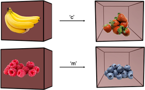

# Data Analysis Pipeline for Fruit Task Pt. 1: Downloading raw data from the cloud



## Step 1. Set up file structures:

Somewhere on your computer, you should have the following file structure set up:

    |--SlipsOfAction 
    |--SlipsOfAction_pandas.py
    	|--data
        |--mongodb_downloads

## Step 2. download from mongodb cloud database

Copy and paste the code below directly into the terminal to download files. This may require some downloads (e.g. mongo). I'd recommend using homebrew. The internet will be helpful with this.

Note: make sure to add username, password, and filename before running the code.

Also note that the output directory should be changed, but make sure to keep the destination folder name 'mongodb_downloads'.

```bash
mongoexport --host calmresearch-shard-0/calmresearch-shard-00-00-svldb.mongodb.net:27017,calmresearch-shard-00-01-svldb.mongodb.net:27017,calmresearch-shard-00-02-svldb.mongodb.net:27017 --ssl --username <username> --password <password> --authenticationDatabase admin --forceTableScan --db test -c entries --out ~/Scripts/JavaScript/NewSlipsOfAction/mongodb_downloads/<filename>.json

```

## Step 3. Run a Python script to convert json data to csv

Open 
`SlipsOfAction_pandas.py`
in a text editor. Change the file directory names to match locations of files on your computer. Make sure to keep 'mongodb_downloads' as is, because the script will take the most recently modified file from this folder. 

Next, run in terminal or preferred IDE:

`python3 SlipsOfAction_pandas.py`

Now, you should see a bunch of csv files in the 'data' folder.

## Next Steps

The next steps involve checking the data and running analyses in R - see Part 2!  
